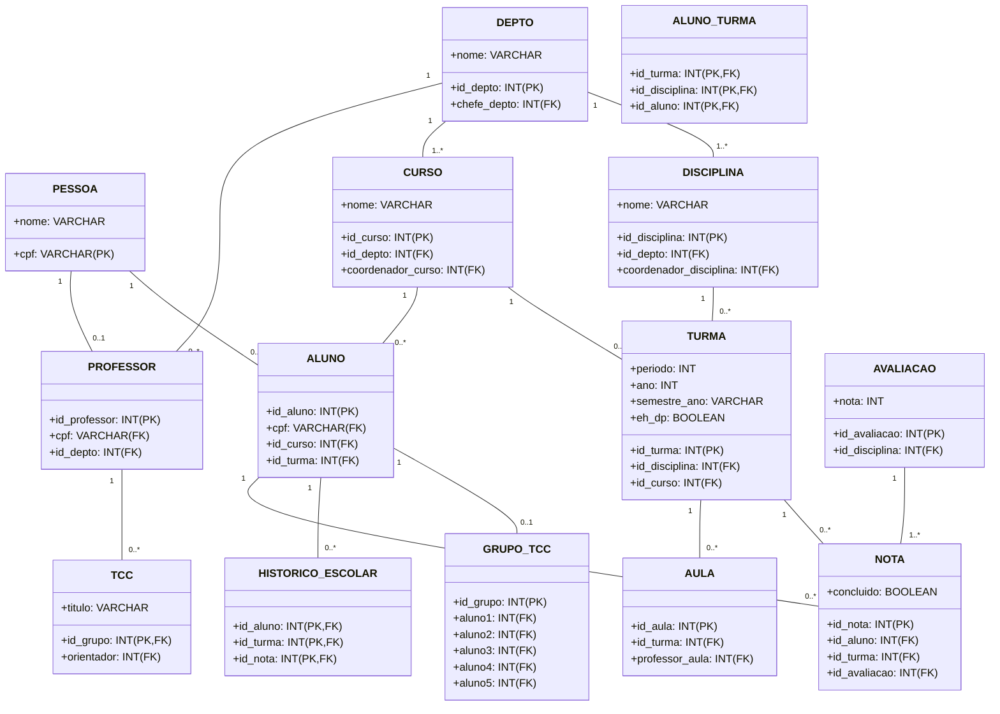
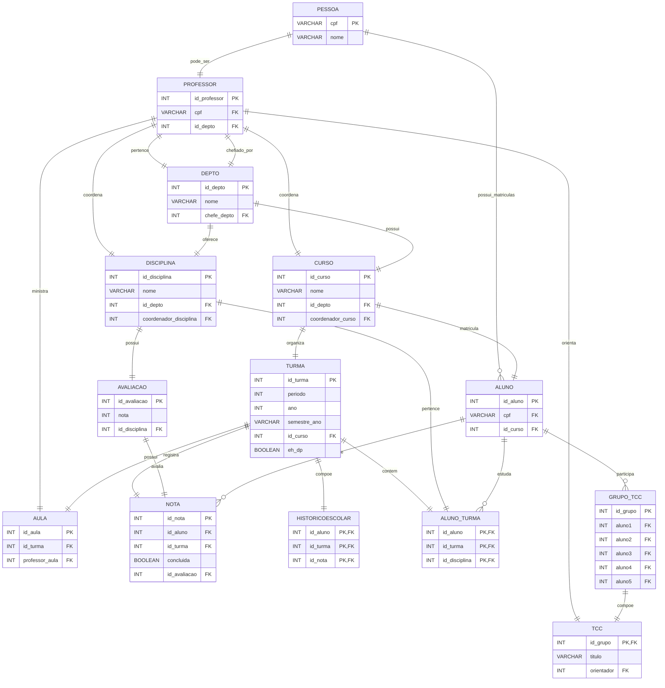

# ProjBancoDeDados
## Membros

Matheus Ferreira de Freitas  RA: 22.125.085-5 

Henrique Hodel Babler        RA: 22.125.084-8

## Mermaid
Os [Mermaid](https://mermaid.live) foi usado para desenhar os diagramas MR e MER.
### MR

### MER

## Como popular rapidamente o banco de dados

1. *preencher_pessoa.py*  
   Cria 8 pessoas fixas (professores) + 60 pessoas aleatórias (CPFs e nomes).

2. *preencher_corpo_docente.py*  
   Cadastra departamentos, insere os 8 professores e define o chefe de cada depto.

3. *formar_turmas.py*  
   Distribui os 60 alunos em três cursos, gera 40 turmas e matricula cada aluno
   de acordo com o período. Também inclui alguns exemplos de dependência (DP) (o qual não conseguimos executar precisamente da maneira descrita).

4. *aulas.py*  
   Liga cada turma a um professor, criando as aulas.

5. *preencher_grade_curricular.py*  
   Garante todas as disciplinas dos cursos, associadas ao departamento correto
   e a um professor coordenador.

6. *preencher_historico_notas.py*  
   Gera avaliações, notas (aprovado/reprovado) e preenche o histórico escolar.

> Execute esses scripts nessa ordem para ter um banco completo e coerente para testes.
